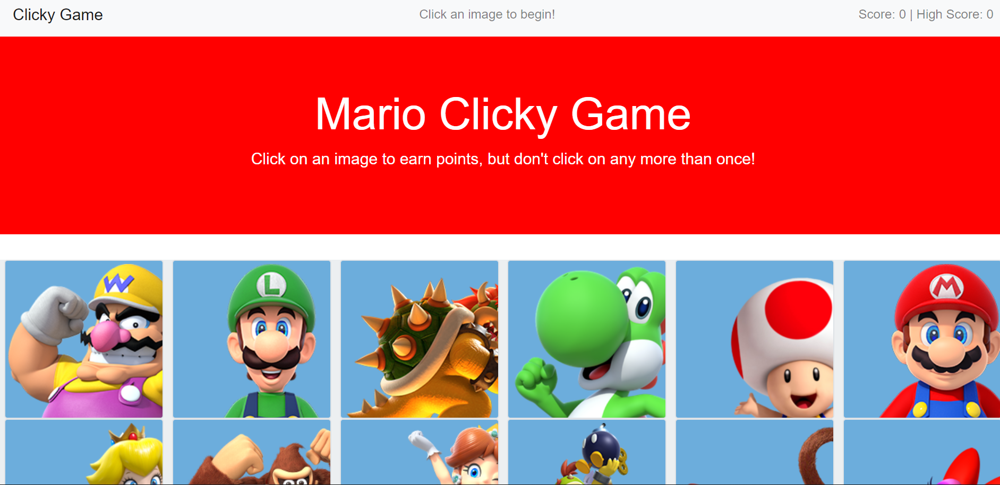

# clicky-mario

## Overview

This is a memory game with React. This assignment breaks the application's UI into components, manages component state, and respond to user events.

  * The application renders different Nintendo Character images to the screen. Each image listens for click events.

  * The application keeps track of the user's score. The user's score is incremented when clicking an image for the first time. The user's score will be reset to 0 if they click the same image more than once.

  * Every time an image is clicked, the images rendered to the page will shuffle themselves in a random order.

  * Once the user's score is reset after an incorrect guess, the game will restart and keep track of the highest score the user achieves.

Check it out: https://jcnimble.github.io/clicky-mario/

### Issues
I used Activity 29 as a starting point to create the image array. This was realatively easy to achieve. I used online images which worked for the most part, but some did not center well in the thumbnail. I tried different methods to adjust this. Likely saving the individual files and cropping them myself would provide better results.

After an online search, I found a straightforward solution to the shuffling of images (https://github.com/kimgomizzou/Clicky-Game.git). I needed some help with setting up the "onClick", but was able to with my Professors help. I then found a solution to help with capturing the high score (https://github.com/bharloe/React-Clicky-Game.git). Cobbling together the various solutions helped me follow the logic and paths in React. This was a good introduction to React for me -- the number of files involved can be overwhelming. If I had more time, I would play more with the how the alerts were delivered and the use of animation.

Deploying to GitHub was difficult, it took seven attempts. I thought I could upload a basic version and then change the file -- but I wasn't able to change the site once it was deployed (https://jcnimble.github.io/mario-clicky/).The final version (https://jcnimble.github.io/clicky-mario/) looks a little different from my local version, but it is deployed.

## Built With

* React

## Authors

* **Jennifer Ginelli** - *Initial work* - [jcnimble](https://jcnimble.github.io/)

## Acknowledgments

   * UPENN201903FSF4-FT/19-react/01-Activities/29-Stu_FriendRefactor/
   * https://github.com/kimgomizzou/Clicky-Game.git
   * https://github.com/bharloe/React-Clicky-Game.git
   * Bryan esteemed Professor
   * Buzz and Aaron dedicated TAs

